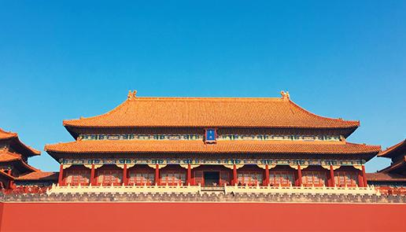
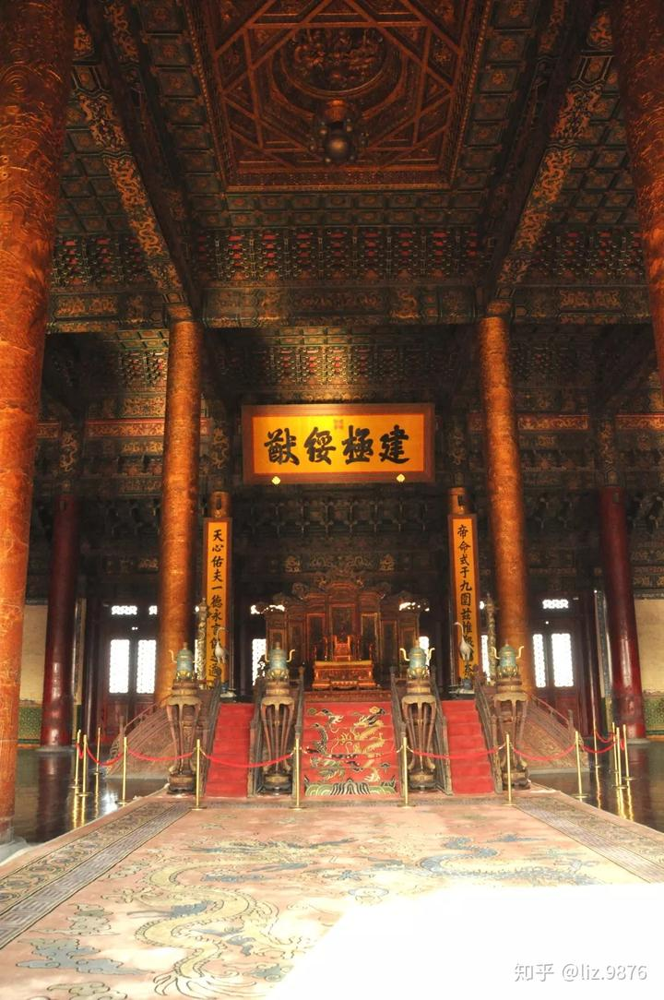
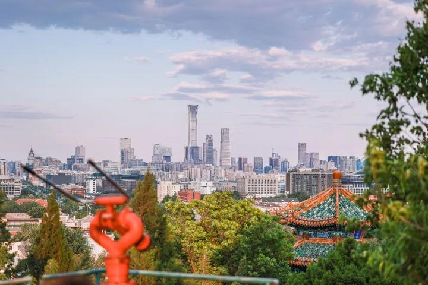

2018年10月1日，国庆长假第一天，我们一家三口来到北京故宫博物院参观。

  

一进午门，首先映入眼帘的是气势恢宏的宫殿建筑群——太和殿、保和殿、乾清宫、交泰殿、坤宁宫及东西六宫等。其中最引人注目的是位于中轴线上的三大殿：太和殿、中和殿、保和殿。它们是明清两代皇帝举行重大典礼的地方，如登基大典、祭天大典、册立皇后大典等都在这里举行。

太和殿又称金銮殿，始建于明永乐十八年（1420年），是中国现存最大的木构建筑之一。它面阔九间，进深五间，重檐庑殿顶，黄琉璃瓦绿剪边，屋脊两端各有一对鎏金铜铸的大吻兽，俗称“仙人走兽”或“飞禽走兽”，象征着皇权的至高无上。在它的正上方悬挂着一块巨大的匾额，上面写着“建极绥猷”四个大字，这是清朝乾隆皇帝御笔亲题。据导游介绍，这四个字出自《周礼·考工记》中的一段话：“匠人营国，方九里，旁三门，国中九经九纬，经涂九轨，左祖右社，面朝后市，市朝一夫唱而万众和也。”意思是说，一个国家应该像工匠建造城市一样，四周有城墙，城内有三条大街，每条大街宽九丈，道路纵横交错，四通八达，这样才方便百姓生活。因此，这个匾额的意思就是告诫人们要遵纪守法，不要扰乱社会秩序。

  

再往里走，我们就来到了紫禁城的中心地带——养心殿。这里是清代皇帝处理日常政务、接见臣子以及召见外国使节的地方。相传当年康熙皇帝曾在这里居住过一段时间，并留下了许多脍炙人口的故事。比如有一次他生病卧床不起，太医们束手无策，只好请来一位民间老中医给他开药方。这位老中医只用了几味简单的中药材，就治好了康熙的病。这件事后来被传为佳话，一直流传至今。现在养心殿已经被改造成了一个展览馆，里面陈列着许多珍贵的文物和历史资料，向人们展示了中国古代宫廷生活的方方面面。

从养心殿出来，我们继续向前走，很快就到达了景山公园。这座公园建于明朝崇祯年间，当时是为了纪念崇祯皇帝殉国而修建的。如今的景山公园已经成为了北京市民休闲娱乐的好去处，每到周末或者节假日，这里总是人流如织，热闹非凡。我们在山顶上俯瞰京城全貌，只见高楼大厦鳞次栉比，车水马龙川流不息，真是一派繁荣昌盛的景象啊！

  

离开景山公园之后，我们又游览了其他几个著名的景点，如珍宝馆、钟表馆、书画馆等等。每一处都给我们留下了深刻的印象，让我们感受到了中华文明的博大精深与源远流长。总之，这是一次非常难忘的旅行经历，不仅开阔了眼界，增长了见识，还增强了民族自豪感和爱国情怀。希望以后有机会还能再来北京旅游，领略更多精彩纷呈的历史文化景观。<TOKENS_UNUSED_1>